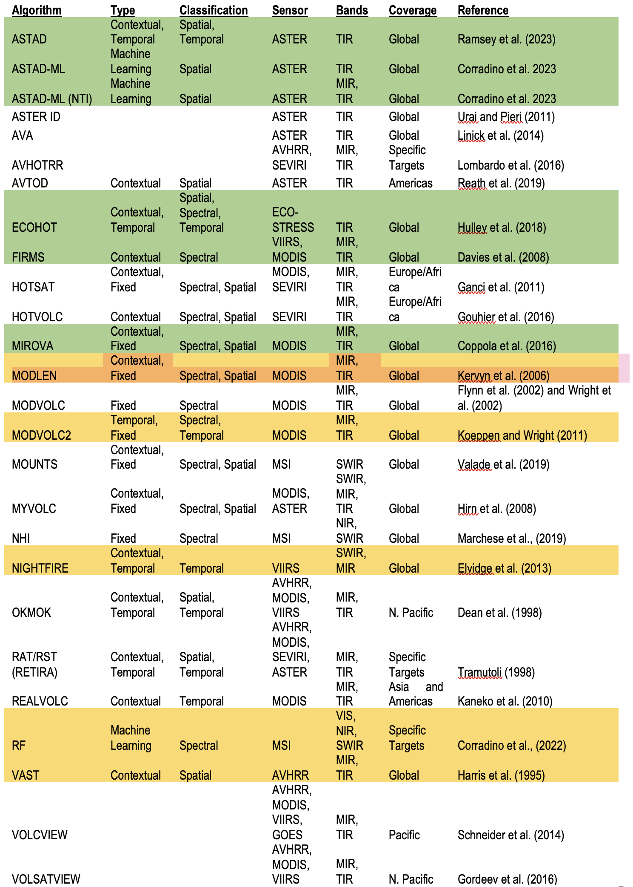

# Surface Biology and Geology (SBG) Observing Terrestrial Thermal Emission Radiometer (OTTER)

## SBG-TIR OTTER Level 3 Elevated Temperature Features (L3-ETF) Data Product Algorithm

[Michael S. Ramsey](https://github.com/michaelsramsey) 
[mramsey@pitt.edu](mailto:mramsey@pitt.edu) 
University of Pittsburgh

[James O. Thompson](https://github.com/jthompson2710) 
[james.thompson@beg.utexas.edu](mailto:james.thompson@beg.utexas.edu) 
University of Texas Austin

[Claudia Corradino](https://github.com/clacor89)  
[claudia.corradino@ingv.it](claudia.corradino@ingv.it) 
National Institute of Geophysics and Volcanology (INGV) – Etna Volcano Observatory

## 1. Introduction

This is the Product Specification Document (PSD) for Level 3 (L3) Elevated Temperautre Features (ETF) data product of NASA's Surface Biology and Geology -- Thermal Infrared (SBG-TIR) mission. The SBG-TIR L3 ETF product provides elevated temperature features generated from data acquired by the SBG-TIR radiometer instrument according to the ETF algorithm described in the SBG-TIR L3 ETF Algorithm Theoretical Basis Document (ATBD) (D-1000786).

This repository will gradually expand to contain the Surface Biology and Geology Thermal Infrared (SBG-TIR) OTTER level 3 elevated temperature features (L3-ETF) data product algorithm. 

This document outlines the theory and methodology for generating the OTTER Level-3 (L3) elevated temperature features (ETF) product. The ETF product uses the MIR and TIR radiance-at-surface data as input. High temperature surface targets such as volcanic eruptions, wildfires, and certain anthropogenic infrastructure result in elevated MIR and TIR radiance. The initial detection and continual monitoring of these features, commonly referred to as "thermal anomalies" are critical for hazard assessment (e.g., new volcanic activity, wildfire movement) and certain anthropogenic outputs (e.g., hydrocarbon gas flaring and stack temperatures). As such, the ETF product will also be made available as a low-latency product in addition to the standard archival processing. The OTTER L3 EFT product will be assessed and validated throughout the mission using a combination of comparative archival IR data analysis of persistent high temperature emitters (e.g., *REFS*) and concurrent MIR and TIR data from other orbital and ground based sensors (e.g., *REFS*).

Early studies using TIR data simply describe the detection of a new thermal anomaly at a quiescent volcano, which later gave rise to models of the sub-pixel temperature distribution as the spatial and spectral resolution of the TIR (and eventually MIR) data improved (REFS). As the temporal frequency also improved, it enabled more accurate modeling of lava and gas flux rates as well as chronological descriptions of each eruptive phase. Ramsey and Harris (2013) summarized the history of satellite based TIR research of active volcanoes into four broad themes: (1) thermal detection, (2) analysis of sub-pixel components, (3) heat/mass flux studies, and (4) eruption chronologies.

More recently, the number, size, and severity of wildfires have increased dramatically with a changing climate, resulting in increased infrastructure damage and decreased air quality (Wooster et al., 2003; Vasileva and Moiseenko, 2013; Jaffe et al., 2020). Multispectral MIR and TIR data of an entire wildfire can aid in active fire detection, movement over time, and plume characterization, all of which are vital for fire managers if the information is provided rapidly. The higher temporal resolution and temperature range IR data provided by OTTER will improve the characterization of dynamic fire fronts, where temperatures fluctuate hundreds of degrees Celsius (Robinson 1991; Roberts et al., 2005; Finney et al., 2015).

OTTER is sensitive to a large range of temperatures thereby enabling detection of most thermal anomalies on Earth without detector saturation (Table 2). The maximum radiometric emission for the typical range of Earth surface temperatures (~ 200 to 330 K) is found in the thermal infrared region (8 -- 13 µm), which shifts to the MIR region (3.5 -- 5 µm) for elevated temperature features (> 500 K) (Figure 1). The emitted energy in these windows for a given wavelength is a function of both temperature and emissivity. Because the ETF product assumes blackbody emission (emissivity, ε = 1.0), derived temperatures could have larger uncertainties for surfaces with an ε \< 1.0.

ETF is applied to the MIR and TIR L1c surface radiance data for the entire land surface imaged by OTTER. Any pixel identified as having an elevated temperature by the algorithm is flagged and used to produce the ETF detection image for each scene. The brightness temperature for each of these pixels is also calculated to create a second data layer. A data quality layer is also included with metrics on the precision and accuracy of the ETF algorithm.

The remainder of the document discusses the SBG instrument characteristics, provides background on TIR remote sensing, presents the testing approach for the numerous algorithms considered, gives a full description and background on the chosen ETF algorithm, provides quality assessment, discuss numerical simulation studies and, finally, outlines a validation plan.

## 2. Product Overview**

SBG-TIR provides a Level 3 product to identify elevated temperature features. This product will contain layers for surface temperature, temperature uncertainty, and data quality for pixels that are flagged as exhibiting elevated temperature features. This product is intended to be used in the detection and monitoring of wildfire and lava flows.

The L3 gridded products are resampled to a map grid with a fixed 60m pixel size, and are used to create 110x110km tile images following the "Sentinel-2 Tiling Grid". Tiled products are provided in Cloud Optimized GeoTIFF (COG) format (UTM/WGS84). See Section 3 for detailed descriptions of the product.

### 2.1. Metadata

SBG-TIR standards incorporate additional metadata that describe each GeoTIFF Dataset within the GeoTIFF file. Each of these metadata elements appear in an GeoTIFF Attribute that is directly associated with the GeoTIFF Dataset. Wherever possible, these GeoTIFF Attributes employ names that conform to the Climate and Forecast (CF) conventions. 

Each SBG product bundle contains two sets of product metadata:
-   ProductMetadata
-   StandardMetadata

#### 2.1.1. Standard Metadata
Each product contains a custom set of `ProductMetadata` attributes, as listed in Table 5. Information on the `StandardMetadata` is included on the [SBG-TIR github landing page](https://github.com/sbg-tir)

#### 2.1.2. Product Metadata

Any additional metadata necessary for describing the product will be recorded in this group.

## 2.2. Level 3 ETF Intermediate and Distributable Products**

The L3 EFT product computes an intermediate background temperature value for thresholding. This value is provided in product metadata accompanying the L3 ETF product.

| **Variable** | **Long Name**   |   **Data Type**  |   **Unit** |  **Field Data** |
| --- | --- | --- | --- | --- |
|  Detects   |  ETF Detections   |  Int8  |    n/a        0 |
|  Temp     |   ETF Temperatures  | Float  |                    |            K          NaN |
|  Accuracy  |  Global Accuracy   | Float  |                   |             n/a        0 |
|  QC       |   Data Quality   |   Int8     |                      |        n/a        0 |

*Table 1: SDSs for the SBG L3 Elevated Temperature Features (ETF) product*

## 2.3.  Level 3 ETF Standard Day, Night, and Low Latency Products**

The L3 ETF detection algorithm will be run during the day and night over land. The "Standard" products are expected to be processed and delivered within 72 hours of their collection. However, a special subset of L3 products will be generated within 24 hours of collection to meet special time-critical science requirements. These "Low Latency" products will be processed using the Low Latency geolocation radiance input only, which may be improved in the standard product. Therefore, the L3 Low Latency product will differ slightly from the subsequent Standard product, and may not be archived after serving their short-term purposes.

The ETF product will also be produced as a low latency (LL) product available within 24 hours of data acquisition. All functional parameters of the algorithm described above will remain the same except that LL-ETF will operate on the at-sensor radiance as opposed to the surface radiance. Without atmospheric correction, the uncertainty in retrieved surface temperatures is expected to be higher.

## 3. Theory and Methodology

### 3.1. Mid-wave and Thermal Infrared Remote Sensing Background

The at-sensor measured radiance in the infrared region (3--13 µm) consists of a combination of different terms from surface emission, solar reflection, and atmospheric emission and attenuation. The Earth-emitted radiance is a function of the temperature and emissivity of the surface, which is then attenuated by the atmosphere on its path to the satellite. The emissivity of an isothermal, homogeneous emitter is defined as the ratio of the actual emitted radiance to the radiance emitted from a blackbody at the same thermodynamic temperature [Norman and Becker 1995]. Emissivity is an intrinsic property of the surface material and is an independent measurement from the surface temperature, which varies with irradiance, local atmospheric conditions, time of day, and specific conditions causing elevated temperature (e.g., wildfires, volcanic eruptions, etc.). The emissivity of most natural Earth surfaces varies from ~0.7 to close to 1.0, for the TIR wavelength (8--13 μm) for spatial scales <100 m. Narrowband emissivities less than 0.85 are typical for most desert and semi-arid areas due to the strong quartz absorption feature (Reststrahlen band) between the 8.0 and 9.5 μm, whereas the emissivity of green vegetation and water are generally greater than 0.95 and spectrally flat in the TIR. Dry and senesced vegetation as well as ice and snow can have lower emissivity values in the wavelengths longer than 10 μm.

Reflected solar radiation in the mid-wave infrared region is non-negligible for highly reflective surfaces, whereas the same term in the thermal infrared region is generally smaller in magnitude (~10%) than the surface-emitted radiance particularly over highly reflective surfaces and on humid days where atmospheric water vapor content is high. This contribution in both IR regions needs to be taken into account in the atmospheric correction process. However, for high temperature surfaces, the emitted radiance (varying by T^4) dominates all atmospheric terms, which are typically ignored using the radiance-at-sensor values for all calculations. These temperatures are calculated using a simple temperature-emissivity approach that assumes an ε = 1.0 at one of the infrared wavelengths and solving the Plank Equation for the emitted surface temperature.

### 3.2. Infrared Thermal Anomaly Detection

The data from spaceborne sensors have been used to detect and monitor volcanic eruptions and wildfires from the earliest days of the satellite era (e.g., Gawarecki et al., 1965; Williams and Friedman, 1970; Scorer, 1986). These studies focused mostly on hot spot detection and temperature measurements using TIR data. They became ever more complex with the launch of new sensors providing better spatial, temporal, and spectral data. For example, the ability to extract critical information from the subtle phases of precursory activity to the detailed spectral mapping of the erupted products grew exponentially (Ramsey and Harris, 2013).

The ever increasing amount of orbital data has resulted in a wide range of temporal and spatial scales with a large number of algorithms designed to automatically detect pixels that are deemed "thermally anomalous". These detection algorithms are commonly rooted in analysis of the spatial, spectral, and/or temporal (or some combination thereof) scales of the data. For example, an algorithm may use the change in temperature of a region over time to identify the appearance of a thermal anomaly (e.g., Tramutoli et al. 1998), whereas other approaches determine the radiance difference between bands (e.g., Wright et al., 2002), or that spectral changes over a spatial area (Coppola et al., 2016a) to identify an elevated temperature feature.

Whether a thermal anomaly detection algorithm operates by assessing radiance (or temperature) in spectral, spatial, or temporal space, the methods can be divided into four categories: fixed threshold, contextual, temporal, or hybrid. Fixed threshold algorithms are spectrally based and use data for a single pixel to assess whether the radiance (or temperature) in the MIR and/or TIR bands is thermally anomalous. In contrast, contextual algorithms use the difference between a pixel's radiance (or temperature) and that of its surrounding pixels (e.g., "the background temperature") to assess its state. Temporal algorithms operate by comparing a pixel's radiance (or temperature) with the preceding historical values for the same pixel over time. These time series allow typical pixel values for any given time of day and year to be defined, and divergences from the baseline to be statistically assessed. However, by definition, they rely on prior data and become more appropriate with increasing mission durations. More recent algorithms have incorporated aspects of one or more of these three categories and are dubbed hybrid approaches. Many of these algorithms are now benefiting from the application of Artificial Intelligence (AI) models to improve these prior statistical approaches (Amato et al., 2023; Corradino et al., 2022; Corradino et al., 2023; Piscini and Lombardo, 2014).

#### 3.2.1. Spatial Approaches

Automated thermal anomaly detection algorithms using spatial approaches were developed by the wildfire and volcano communities during the 1990s (e.g., Flasse and Ceccato, 1996; Flynn et al., 1994; Justice and Dowty, 1994; Langaas, 1993; Lee and Tag, 1990). These applied flexible thresholds based upon statistics calculated from pixels in the image region immediately surrounding a target pixel. For example, the fire detection algorithm of Lee and Tag (1990) executed five steps that used AVHRR MIR and TIR data to determine whether the brightness temperature of a target pixel was anomalously elevated above that of its eight neighboring pixels. This spatial approach was the basis of the first automated volcanic hot spot detection algorithm applied in volcanology (Harris et al., 1995), following the methods of Lee and Tag (1990) and Langaas (1993), resulting in the development of the Volcanic Anomaly SofTware (VAST) algorithm (Higgins and Harris, 1997). Initially, VAST was tested using AVHRR data for Etna, Vulcano, Stromboli, and Lipari volcanoes (Harris et al., 1995; Higgins and Harris, 1997), as well as wildfires in Australia (Harris, 1996), and was designed to detect thermally anomalous pixels by comparing the temperature difference (∆T) for each pixel with the mean from its surrounding eight pixels. The algorithm was later adapted to GOES data of Hawai'i (Harris et al., 2001), by highlighting pixels with a ΔT that was greater than the ΔT mean plus 3.3σ for a 5-pixel-wide box surrounding a 10 × 10 pixel target zone. Since the development of VAST, other algorithms have been designed based on the similar principles and operations adopting different criteria for the pixel-wide box localization and dimension and ΔT threshold choices (e.g. Murphy et al., 2011). Many algorithms have been implemented for local-to-regional monitoring purposes including AVHRR-based monitoring the volcanoes of Mexico (Galindo and Dominguez, 2002), Central America (Webley et al., 2008), and Japan (Kaneko et al., 2002).

#### 3.2.2. Spectral Approaches

Thermal anomaly detection algorithms using a spectral analysis were first developed in the 1980s using AVHRR data to automatically detect wildfires (e.g., Flannigan and Vonder Haar 1986; Kaufman et al. 1990; Kennedy et al. 1994). These rely upon a data from at least two distinct spectral regions where the thermal flux from high temperature source can vary over orders of magnitude (Figure 1). They operate by setting a threshold and highlighting any values that exceeded this threshold. For example, Kaufman et al. (1990) used three thresholds: (1) MIR~T~ ≥ 316 K, (2) ΔT ≥ 10 K, and (3) TIR~T~ \> 250 K to find thermally anomalous pixels. These thresholds ensured that (1) the pixel was hot, (2) a sub-pixel hot spot was present, and (3) the pixel was cloud free. Every subsequent algorithm varies the level of the set thresholds, setting different values depending on the region monitored. These early algorithms performed well but were limited to the specific regions for which they were developed (Justice and Dowty 1994).

A volcano-targeted single-step spectral algorithm was developed by Di Bello et al. (2004) for Mt. Etna, Italy. The results highlighted that a simple single-step threshold of ΔT \> 10 K produced hundreds of false detections. A more robust spectral approach applied to volcano thermal anomaly detection was developed by Harris et al. (2002) who introduced a multi-step threshold algorithm to detect anomalies in GOES data. The initial algorithms used the reflective, ΔT, MIR, and TIR properties of the pixel and its background to assess anomalies and probabilities.

Perhaps the most well known and widely used spectral algorithm is MODVOLC (Flynn et al. 2002). It was designed using a limited operational constraint to detect volcanic thermal anomalies on a global scale in MODIS data (Wright et al. 2004). Because of the simplicity of algorithm and the longevity of the MODIS sensors, MODVOLC results have been widely used, contributing to activity reports by the Smithsonian Institute's Global Volcanism Program (GVP), as well as numerous individual volcano studies, for example, Anatahan (Wright et al. 2005), Mt. Belinda (Patrick et al. 2005), Etna (Laiolo et al., 2019), Melanesia (Rothery et al. 2005), Pacaya (Gonzalez-Santana et al., 2022) Stromboli (Ripepe et al. 2005), Fuego (Lyons et al. 2010), and Vanuatu (Coppola et al., 2016b).

#### 3.2.3. Temporal Approaches

Thermal anomaly detection algorithms using temporal approaches were developed to detect variations in pixel brightness temperature from that of the baseline temperature in long time-series data. These have been effective for a variety of applications including detection of volcanic ash clouds, dust storms, wildland fires, and earthquake-related thermal anomalies (Hua et al., 2016; Jiao et al., 2021). Tramutoli (1998) originally proposed a temporal technique named the Robust AVHRR Technique (RAT) to minimize the effects that different geographical and seasonal conditions have on fixed spatial and spectral algorithms.

Temporal algorithms analyze an archive of data to evaluate how the temperature for a specific pixel changes through time, assessing variation caused by seasonal and atmospheric effects. By comparing the pixel's current temperature to the temperature history of that same pixel, divergence can be detected. Given that exactly the same pixel needs to be considered through time, the technique requires precise, sub-pixel location accuracy, and excellent image-to-image registration (Tramutoli et al., 2001; Pergola and Tramutoli, 2003). AVHRR data for Etna, showed how the method could be used with reflected (AVHRR band 1) data to detect ash clouds, developing an index named the Statistical Normalized Albedo Excess (Pergola et al., 2001). Additionally, the Absolutely Local Index of Change of the Environment (ALICE) that used TIR (AVHRR band 4) data was developed to detect possible thermal anomalies associated with seismic activity (Pergola et al., 2001). Similar techniques were used with MIR (AVHRR band 3B) data to detect lava flow activity on Mt. Etna through application of the ALICE index (Pergola et al., 2004; Di Bello et al., 2004; Pergola et al. 2009; Pergola et al. 2008; Yuhaniz and Vladimirova, 2009).

#### 3.2.4. Hybrid Approaches

Combining more than one of these approaches allows the individual limitations associated with each to be minimized. Advanced hybrid algorithms have been developed applying a temporal approach to spatial features (e.g., Ramsey et al., 2023; Koeppen et al., 2011). Other algorithms combine both spectral and spatial principles based on multiple fixed and statistical thresholds such as MIROVA used to identify anomalies in MODIS data (Coppola et al. 2016a; 2020) and HOTSAT used with SEVIRI data (Ganci et al., 2011). More recently, advanced AI techniques have been proposed to replicate the human visual system processing scheme and reduce the errors in statistical approaches to detect thermal anomalies in TIR data. For example, Corradino et al., (2023) used both spectral and spatial information with deep convolutional neural networks (CNNs) to identify thermal anomalies over twenty years at Vulcano, Italy.

### 3.3. Prior Accuracy

Regardless of the general approach to identifying thermally elevated pixels in an infrared image, every algorithm aims to detect the greatest number of true thermal anomalies by minimizing errors related to false positives. This goal is crucial to perform operationally over a global scale under widely varying conditions. In order to evaluate the algorithm performance, it is fundamental to create a validation and target dataset using ground truth. The latter is created by identifying and manually labelling true anomalies in each testing image by visual inspection. However, defining if a pixel is a true anomaly is not a trivial task, which led past efforts to adopt three main strategies to compute algorithms accuracy.

The first is more qualitative and is based on the visualization and correlation of the time series of thermal-related variables, such as the total number of detected anomalies, with the corresponding time series of a reference ground truth. The latter can be either independent datasets, e.g. MYVOLC (Hirn et al., 2008), or the historical sequence of known thermal events, (e.g. MODVOLC (Flynn et al., 2002) and (Wright et al., 2002) as well as ASTAD (Ramsey et al., 2023), which has a reported pre/co-eruptive accuracy of ∼81%).

The second strategy consists in evaluating the algorithm capability of identifying the presence of real thermal anomalies in the image. Thus, in this case, the accuracy is computed based on the percentage of successful detections and false detection (i.e., commission error). Successful detection occurs if the algorithm detects at least one anomaly in an image that contains true anomalies. This metric is expressed in terms of omitted detections (i.e. the complementary of successful detections). False detection occurs where the algorithm detects an anomaly in an image that has no true anomaly. Most of the hotspot detection algorithms adopt this strategy for the performance evaluation, however, require a large validation dataset. MIROVA reports 10% of omitted detections and 5% of false detections (Coppola et al., 2016a); the performance of FIRMS algorithm has been evaluated in different study cases showing a commission error from 20% to 85% depending on the VRP intensity (Fu et al., 2020) and an overall accuracy of MODIS ranged from 0.6% to 23.4% and VIIRS S-NPP from 1.3% to 25.6% (Coskuner 2022).

The third strategy consists in evaluating the algorithm capability to provide finer scale information about the thermally anomalous area in the image. For example, detecting all the pixels that are true anomalies in each image (high recall) and minimizing false positive detections (high precision). In this case, the algorithm performance is based on four main indices, namely precision, recall, F1-score, and the global accuracy (i.e., the correct prediction of anomaly/background pixels over the total number of pixels). Because the process of creating the target dataset is time consuming for a large dataset, very few hot spot detection algorithms have adopted this strategy. Among them, ASTAD-ML (Corradino et al., 2023) reported precision, recall, F1 score and global accuracy of 87%, 85%, 86%, and 99%, respectively.

### 4. Uncertainty Quantification Analysis**

NASA has identified a major need to develop long-term, consistent products valid across multiple missions, with well-defined uncertainty statistics addressing specific Earth-science questions. These products are termed Earth System Data Records (ESDRs).

## 5. Cal/Val: Elevated Temperature Features (ETF) Algorithm Testing

The elevated temperature features (ETF) algorithm for SBG must rapidly and accurately detect thermal change in some of Earth's most dynamic processes (i.e., volcanic activity, wildland fires) with a low rate of false positives. Over twenty different algorithms previously developed by the earth science community were considered and a subset of those selected for further testing. This testing approach and the results are first described below with the final ETF algorithm implementation presented in §4.6.

### 5.1. Test Data Creation

Five simulated OTTER datasets were created from airborne MASTER data using the pre-existing MASTER wavelengths or weighted band averages for the OTTER band center positions that did not align with those of MASTER (Figure 1). The data were also spatially resampled to the planned resolution of OTTER and the atmospheric correction was modified for the performance characteristics (e.g., FPA response) and viewing geometry of OTTER. These simulated data were chosen to test many of the SBG geology higher level data products and therefore include data with known thermal anomalies others with no thermally elevated areas. The latter included compositionally varied targets (e.g., Kelso Dunes, Yosemite National Park) for testing the Surface Mineralogy (SM) product algorithms. However, here they served as null test locations for the ETF algorithm. Both day and night time datasets were utilized.

                                                   
*Figure 1. False color image data (11.35, 9.07, 8.32 µm: RGB) of the simulated OTTER data used in the ETF algorithm testing process.*

### 5.2. Algorithm Testing Criteria

Twenty six previously developed algorithms were considered across the different categories (i.e., contextual, fixed, temporal), classifications (i.e., spatial, spectral, temporal), and coverage (i.e., global, targeted) (Table 4). This list was then down selected based on the following criteria based on the mission objectives of SBG (in order of priority):

1.  Openly available without restrictions -- following NASA open science, open data initiatives (TOPS)

2.  Applicable on a global scale

3.  Only require MIR and TIR data

4.  Computationally fast

5.  No predetermined knowledge of the likely location of anomalies is required

6.  Limited use of temporal classifies in the automation process

*Table 4. Previously developed thermal anomaly detection algorithms considered for ETF testing. Green: selected for initial testing, orange: potential expanded testing, white: not considered*

### 5.3. Algorithm Selection for Testing

Based on these criteria, six initial algorithms were selected for the first set of testing (green in Table 4) and five others were selected for possible expanded testing (orange in Table 4). These algorithms were chosen first based on open access and availability. The initial selection includes algorithms that span the entire classification schemes and types currently available. Further, algorithms that could be applied over global scales, used both MIR and TIR data, and were computationally fast were given priority. Algorithms that require large quantities of prior knowledge or large time series were not considered. As a result, algorithms that solely rely upon temporal classification schemes were eliminated. The algorithms initially selected were then tested on the simulated data to evaluate the accuracy, precision, speed, and errors. A second subset of algorithms (highlighted in orange in Table 4) were selected for future expanded testing if required. Algorithms not highlighted in Table 4 were determined to be either not appropriate for the SBG-TIR mission based on the selection criteria or they were similar to the algorithms already highlighted.

#### 5.3.1. Subset for Expanded Evaluation

The down selection processes highlighted six candidate algorithms, chosen based on the criteria outlined in section 4 and represent the range of algorithm types and classes that are applicable to the SBG mission. The six algorithms selected for evaluation are: ASTAD, ASTAD-ML, ASTAD-ML (NTI), ECOHOT, FIRMS, and MIROVA. These have been published and have well established lineages, but not all have been used operationally.

ASTAD is the most complex statistically based approach that automatically detects the entire temperature range of thermal anomalies in both day and night ASTER TIR data (Ramsey et al., 2023). Significantly, ASTAD also produces a very low percentage of false positives and is excellent for extracting subtle (\< 2 K) thermal anomalies. The algorithm contains four main steps: (1) image pre-processing, (2) background normalization, (3) Gabor-based filtering, and (4) anomaly identification. It also addresses issues that historically have plagued past algorithms applied to high spatial resolution TIR data (e.g., clouds, gas plumes, solar-heated slopes in daytime TIR data, etc.).

ASTAD-ML uses a convolutional neural network (CNN) deep learning model, whose structure is inspired by the brain\'s primary visual cortex allowing it to replicate the way in which it detects thermal anomalies in an image (Corradino et al., 2023). CNN exploits deep, locally connected layers to extract discriminative features (e.g., the spatial distribution of thermal anomalies) and classifies pixels in anomalies and background. The ASTAD-ML model is a supervised CNN, i.e. UNET (Ronneberger et al., 2015), and it was trained on ASTER TIR Band 13 (10.25--10.95 µm) data using the results from the original ASTAD study (Ramsey et al., 2023) for the labeling phase. Here, the ASTAD-ML trained model is applied to the simulated data using the closest available SBG band to ASTER TIR Band 13. Importantly, no attempt was made to modify or retrain the model using the new datasets. Therefore, results are expected to be worse than those using ASTER-based training and ASTER test data. A variation of the ASTAD-ML approach is the ASTAD-ML (NTI) was also tested. Rather than using a single TIR band, the Normalized Thermal Index (NTI), computed using one MIR and TIR band (Wright et al., 2002), was tested as the input to the ML model. Any ML-based approach chosen for SBG data product generation will require further testing prior to the SBG launch using larger datasets such as MODIS or VIIRS. These results can be refined during the checkout phase of the SBG mission to further improve its performances.

The ECOHOT algorithm is based on the ECOSTRESS cloud detection algorithm, ECOCLOUD (Hulley, 2018) but adapted for hot temperature anomalies. The algorithm uses a hybrid spatio-temporal statistical method in which thresholds are determined dynamically based on location, time of day, and time of year. The algorithm derives its heritage from a Bayesian classification scheme used for cloud detection for the Advanced Along Track Scanning Radiometer (AATSR) (Bulgin et al. 2014; Merchant et al. 2014), and its successor the Sea and Land Surface Temperature Radiometer (SLSTR). The algorithm can identify both cold (i.e. cloud) and hot temperature anomalies by comparing observed brightness temperatures in the longwave IR (10-12µm) with a set of global Look Up Tables (LUTs) derived from simulated data. The RTTOV radiative transfer model was used to simulate clear-sky brightness temperatures over a range of atmospheric conditions, surface emissivities, and temperatures using a combination of numerical weather prediction data (GEOS5) and the ASTER Global Emissivity Dataset (GED) (Hulley et al. 2015). The observed brightness temperatures are then compared to interpolated values of the LUTs (in time, space) corresponding to the observed scene location and time, and pixels are classified as anomalously cold/hot depending on a set of confidence level thresholds. []{.mark}

FIRMS is divided into day and nighttime modules. Both detection modules rely on thermal sensitivity in the MIR and TIR regions, exploiting the emissive component of wildfires in the 2.2-12 µm spectral range (Giglio et al., 2008). In both day and nighttime data, the radiometric signature of thermal anomalies produces a radiance or reflectance anomaly compared to the background. Thresholds were determined based on training data using histogram analysis of single channel and dual-channel (e.g., band ratios and differencing) data supported by detailed supervised pixel classification information. These supporting data (e.g., aerial photography and commercial satellite image data available in Google Earth) were used to validate fire activity originally identified by the detection algorithm. The algorithm thresholds were defined for TOA reflectance data that had not been corrected for solar elevation.

MIROVA is a multi-step hybrid anomaly detection approach combining spectral and spatial principles (Coppola et al., 2016a). In particular, the spectral analysis involves the use of both MIR and TIR bands to first compute NTI and then the Enhanced Thermal Index (ETI) is computed. This latter index enhances the presence of hotspots by emphasizing the MIR radiance response in presence of heat sources. A spatial analysis is then performed to detect as anomalous pixels having values higher than the surroundings based on the use of both fixed and contextual thresholds.

### 5.4. Testing Methodology

The algorithms were tested with minimal modification from the original development code to gain an operational evaluation of the algorithms. However, minor modifications were made for the spatial and spectral specifications of the SBG simulated dataset (e.g., band selection close to original wavelength used).

### 5.5. Testing Results

The results and the performance metrics are summarized by computing the evaluation metrics for all the test cases. A detailed focus is also presented for two of the cases: 1) an image with confirmed elevated temperatures (Hawaii-Night) and 2) the null hypothesis case having no anomalies (Kelso Dunes).

#### 5.5.1. Hawaii Night

Nighttime TIR airborne data were acquired over the Big Island of Hawaii on February 1, 2018 at 08:01 UTC (January 31, 2021 at 22:01 HST). During this period two main eruption styles were observed at Kīlauea volcano: (i) an overturning lava lake in the Halema'uma'u Crater that was continuous from 2008 to 2018 (Patrick et al. 2013) and (ii) an extensive lava flow field emanating mainly from the Pu'u 'Ō'ō vent (Wolfe et al., 1987; Heliker and Mattox, 2003; Orr et al., 2013). These produced a large number of thermal anomalies in the image. Anomalous pixels were first identified manually to create the validation dataset from which all algorithm performances were assessed. All the algorithms detected the thermal anomalies in the lava flow field on the coastal plain to the south (Figure 2). However, there is a discrepancy between the algorithms for those anomalies located at the lava lake. For example, ASTAD found no anomalies, whereas FIRMS and MIROVA over estimated them in this region. This discrepancy is likely a result of the intermittent cloud over this region at the time of data acquisition. Retrieved temperatures of the anomalies are show in Figure 3.

*Figure 2. Hawaii (night) thermal anomaly detections for the six algorithms tested.*

*Figure 3. Hawaii (night) retrieved temperatures with the detection mask (red) overlain for the six algorithms tested.*

#### 5.5.2. Kelso Dunes

Daytime TIR airborne data were acquired over the Kelso Dunes region, southern California on September 20, 1999 at 18:47 UTC (10:47 PDT). The dunes are composed of mostly quartz, plagioclase feldspar, and potassium feldspar minerals (Ramsey et al., 1999). This dataset was used as a null hypothesis case, to test the false positive rate of the algorithms over low emissivity (high reflectance) surfaces. ASTAD and MIROVA correctly did not identify the presence of thermal anomalies. ASTAD-ML, ASTAD-ML (NTI), and ECOHOT found \<10 anomalies, whereas FIRMS incorrectly registered over two thousand anomalies.

*Figure 4. Kelso Dunes thermal anomaly detections for the six algorithms tested.*

#### 5.5.3. Testing Assessment

The testing of the thermal anomaly detection algorithms involved creating a validation dataset by manually selecting all anomalies in the Hawaii scene. Therefore, the final performance metrics are subject to the accuracy of the manual anomaly classification. The performance analysis of each algorithm was summarized in tables reporting the accuracies. These included the true positives (TP, number of anomalous pixels correctly predicted), true negatives (TN, number of background pixels correctly predicted), false positives (FP, number of background pixels incorrectly predicted as anomalous), and false negatives (FN, number of anomalous pixels incorrectly predicted as background).

These results were used to calculate evaluation metrics, namely the precision, F1-score, recall, and global accuracy with values ranging from 0 to 1. Precision, also called Positive Predictive Values (PPV), measures the probability that a predicted anomalous pixel is real and is inversely proportional to the number of false positives. This metric reflects the algorithm's tendency in overestimating anomalies. A low value means that the number of false positive is high and thus that the algorithm detects more anomalous pixels than are real. Recall, also called True Positive Rate (TPR), measures the probability that a true anomalous pixel will be correctly predicted, and it is inversely proportional to the number of false negatives. This metric reflects the algorithm's tendency in underestimating anomalies. A low value means that the number of false negatives is high and thus that the algorithm detects less anomalous pixels than are real. F1-score combines precision and recall into a single metric. It is a measure of algorithm's accuracy and is particularly important if the testing dataset is unbalanced (i.e., far more samples belong to the negative class, which is the case for all our test data). The global accuracy measures the probability of making correct predictions without differentiating between positive and negative classes. Finally, we report the computation time to determine the best possible ETF candidates for the SBG mission. The greatest weight given to that choice is the F1-score because of the larger amount of non-anomalous pixels, with precision also heavily favored to limit the number of false positive detections.

The larger proportion of background pixels makes the datasets unbalanced; thus the global accuracy is mainly biased by the proportion that are correctly predicted (TN). This value is high (close to 1) for all the algorithms tested; however, it does not reflect the algorithm's ability to accurately detect thermal anomalies. Therefore, we focus on the indexes where the TN are not counted, namely recall, precision, and the F1-score. Recall (TPR) shows the model's capability of detecting the thermal anomalies (high value means low false negative detection). High recall values are obtained using FIRMS and MIROVA (0.87); whereas low values are obtained using ASTAD and ASTAD-ML (0.12 to 0.4) showing that they underestimate the number of anomalies (Table 5). Precision (PPV) shows a model's capability in predicting thermal anomalies that are real. A high value means low false positive detection, thus reflecting the model tendency in overestimating anomalies. High values (low false positives) are shown for algorithms ASTAD, ASTAD-ML, ASTAD-ML (NTI) and ECOHOT (0.76 to 1), whereas the lowest values were found with FIRMS and MIROVA (0.3 to 0.4) showing that they overestimate the number of thermal anomalies (Figure 6). The F1-score is the harmonic mean of recall and precision and it provides the accuracy level for unbalanced datasets. The highest values (from 0.52 to 0.79) for this study case are produced by ECOHOT followed by FIRMS and ASTAD-ML (NTI). Computational speed was the quickest for FIRMS and MIROVA, followed by ECOHOT. As expected, the more detailed processing complexity of ASTAD made it slower.

|  **Hawaii Night**     |   **ASTAD**    |  **FIRMS**  |    **MIROVA**  |   **ASTAD-ML** |  **ECOHOT**  |   **ASTAD-ML (NTI)** |
| --- | --- | --- | --- | --- | --- | --- |
|  **Precision**      |     1.00000    |    0.38384   |     0.34473   |     0.96285   |     1.00000    |    0.75890 |
|  **F1 Score**            0.22205     |   0.53410     |   0.49393    |    0.41689    |    0.79485    |    0.52490 |
|  **Recall**        |      0.12489    |    0.87767    |    0.87083   |     0.26604   |     0.65954   |     0.40120 |
|  **Global Accuracy** |    0.99905   |     0.99833     |   0.99806   |     0.99919   |     0.99963   |     0.99921 |
|  **Time (secs/pixel)**  | 3.7 × 10^-4^  | 2.7 × 10^-7^  | 2.4 × 10^-7^  | 3.2 × 10^-5^  | 6.7 × 10^-6^ |  2.9 × 10^-5^ |

*Table 5: Hawaii (night) performance metrics*

In the Kelso Dunes study case, only the background class is present meaning that only the TN and FP can be computed (Table 6). FIRMS performs the worst having a lower accuracy and thus higher FP with a type 1 error of 1.45% (i.e., type 1 error = 1- global accuracy).

|  **Kelso Dunes**  |       **ASTAD**  |    **FIRMS**   |   **MIROVA** |    **ASTAD-ML** |  **ECOHOT**  |   **ASTAD-ML (NTI)** |
| --- | --- | --- | --- | --- | --- | --- |
|  **Precision**    |       NaN     |       NaN       |     NaN      |      NaN      |      NaN       |     NaN |
|  **F1 Score**     |       NaN       |     NaN      |      NaN     |       NaN      |      NaN      |      NaN |
|  **Recall**       |       NaN       |     NaN      |      NaN      |      NaN      |      NaN        |    NaN |
|  **Global Accuracy**   |  1.00000    |    0.98547    |    1.00000   |     0.99996   |     0.99995    |    0.99997 |
|  **Time (secs/pixel)** |  6.0 × 10^-4^  | 8.0 × 10^-7^ |  5.8 × 10^-7^  | 3.8 × 10^-5^ |  2.4 × 10^-5^ |  3.9 × 10^-5^ |

*Table 6. Kelso Dunes performance metrics*

Finally, the overall testing results are considered for the algorithms performance evaluation phase. Thus, the overall TN, TP, FN and FP are computed from the five test images shown in Figure 1. In particular, because the primary goal is to quickly detect accurate thermal anomalies and reduce the number of false positive, precision is more heavily weighted. The highest precision values (0.22 to 0.5) are shown for ASTAD, ASTAD-ML and ASTAD-ML (NTI) meaning that less false positives are detected; whereas the lowest are computed with ECOHOT, FIRMS and MIROVA (0 to 0.13) meaning that they greatly overestimate the number of thermal anomalies (Table 7). The highest recall values are obtained using FIRMS (0.6) and MIROVA (0.65) meaning they are better able to detect the real anomalies; whereas low values (0.2 to 0.3) are obtained using ASTAD, ASTAD-ML and ASTAD-ML (NTI) showing that they underestimate the number of real thermal anomalies. Generally speaking, the global accuracy is high for all the algorithms, however the capability to accurately detect a thermal anomaly is shown by F1-score. It is generally low for all the algorithms with the best performance given by ASTAD-ML (NTI) with 0.35. ASTAD, ASTAD-ML, and ASTAD-ML (NTI) have similar values for precision, recall and F1-score. The others show higher discrepancy (i.e., recall far higher than precision and F1-score) and thus a clear bias of those algorithms in overestimating. The timing values show that ASTAD is computationally the slowest, whereas FIRMS and MIROVA are three orders of magnitude faster.

|  **Totals**       |       **ASTAD**  |    **FIRMS**  |    **MIROVA**  |   **ASTAD-ML** |  **ECOHOT**  |   **ASTAD-ML (NTI)** |
| --- | --- | --- | --- | --- | --- | --- |
|  **Precision**    |       0.22836    |    0.10130    |    0.12944    |    0.49113    |    0.05075    |    0.42645 |
|  **F1 Score**      |      0.21525    |    0.17526    |    0.21303    |    0.28822    |    0.09289    |    0.35230 |
|  **Recall**       |       0.20357    |    0.64948    |    0.60140    |    0.20396    |    0.54711    |    0.30012 |
|  **Global Accuracy**  |   0.99949    |    0.99789    |    0.99847    |    0.99965    |    0.99631    |    0.99962 |
|  **Time (secs/pixel)**  | 3.8 × 10^-4 |  2.9 × 10^-7  | 2.0 × 10^-7 |  3.1 × 10^-5 |  5.9 × 10^-6  | 3.2 × 10^-5 |

*Table 7: Overall performance metrics*

FIRMS and MIROVA (followed by ECOHOT) are the top candidates based solely on processing speed, with each having higher recall (lower false negatives) but lower precision (higher false positives) values. Conversely, the ASTAD suite are much better at minimizing false positives, but their speeds likely make them impractical for the ETF implementation. Finally, it should be noted that MIROVA was only tested using the first stage of the algorithm (NTI). Full implementation using the second stage (ETI) would likely improve the false positive rate, but also add to the processing time. This will be caried out in the planned second phase testing.

#### 5.5.4. Algorithm Sensitivity to Instrument Performance

The instrument is anticipated to have an NEΔT of 0.2 K at 300 K, which corresponds to an average NEΔL of 0.030917 Wm^-2^sr^-2^µm^-1^. To evaluate the sensitivity of the algorithms to a reduction in instrument performance on orbit the NEΔT is increase to 1.0 K at increments of 0.2 K.

|  **0.2 K NEΔT**       |       **ASTAD**  |    **FIRMS**  |    **MIROVA**  |   **ASTAD-ML** |  **ECOHOT**  |   **ASTAD-ML (NTI)** |
| --- | --- | --- | --- | --- | --- | --- |
|  **Precision**    |       0.22836    |    0.10130    |    0.12944    |    0.49113    |    0.05075    |    0.42645 |
|  **F1 Score**      |      0.21525    |    0.17526    |    0.21303    |    0.28822    |    0.09289    |    0.35230 |
|  **Recall**       |       0.20357    |    0.64948    |    0.60140    |    0.20396    |    0.54711    |    0.30012 |
|  **Global Accuracy**  |   0.99949    |    0.99789    |    0.99847    |    0.99965    |    0.99631    |    0.99962 |
|  **Time (secs/pixel)**  | 3.8 × 10^-4 |  2.9 × 10^-7  | 2.0 × 10^-7 |  3.1 × 10^-5 |  5.9 × 10^-6  | 3.2 × 10^-5 |

*Table 8: 0.2 K NEΔT performance metrics*

|  **1.0 K NEΔT**       |       **ASTAD**  |    **FIRMS**  |    **MIROVA**  |   **ASTAD-ML** |  **ECOHOT**  |   **ASTAD-ML (NTI)** |
| --- | --- | --- | --- | --- | --- | --- |                                                                                                                    
|  **Precision**  |  0.21369    |    0.00335    |    0.34380    |    0.79407    |    0.00034    |    0.67289 |
|  **F1 Score**   |   0.22592    |    0.00668    |    0.40346   |     0.30257    |    0.00069   |     0.40875 |
|  **Recall**     |        0.23963   |     0.90461   |     0.48817    |    0.18689    |    0.99961     |   0.29352 |
|  **Global Accuracy**     |         0.99943      |  0.90724      |  0.99950      |  0.99970   |     0.00069     |   0.99971 |
| **Time (s/pixel)**       |         3.8 × 10^-4  | 2.9 × 10^-7  | 2.0 × 10^-7 |  3.1 × 10^-5 |  5.9 × 10^-6 |  3.2 × 10^-5 |

*Table 9: 1.0 K NEΔT performance metrics*

|  **Percentage Change from 0.2 to 1.0 K NEΔT**       |       **ASTAD**  |    **FIRMS**  |    **MIROVA**  |   **ASTAD-ML** |  **ECOHOT**  |   **ASTAD-ML (NTI)** |
| --- | --- | --- | --- | --- | --- | --- |    
  **Precision**   |   -6.42407   |    -96.68904   |   165.60569   |   61.68224  |     -99.32030  |    57.78872 |
  **F1 Score**     |    4.95703     |   -96.18664   |   89.39117    |   4.97884   |     -99.25752  |    16.02328 |
  **Recall**    |   17.71381   |    39.28219   |    -18.82774   |   -8.36929   |    82.70732   |    -2.19912 |
  **Global Accuracy**    |     -0.00600   |    -9.08417   |    0.10316     |   0.00500    |    -99.93123  |    0.00900 |
  **Time (s/pixel)** |    0.0       |     0.0       |     0.0     |       0.0      |      0.0       |     0.0 |

*Table 10: Percentage Change from 0.2 to 1.0 K NEΔT performance metrics*

Overall, the precision, F1 score, recall, and global accuracy of the ASTAD, MIROVA, ASTAD-ML, and ASTAD-NTI-ML algorithms either improved or remained the same (\<10%) as a result of the instrument NEΔT increasing from 0.2 to 1.0 K. On the other hand, the precision, F1 score, and global accuracy of the FIRMS and ECOHOT algorithms reduced dramatically by nearly 100% in most cases as a result of instrument performance decreasing to 1.0 K NEΔT.

### Acknowledgements

The research was carried out at the Jet Propulsion Laboratory, California Institute of Technology, under a contract with the National Aeronautics and Space Administration.

### References

Amato, E., Corradino, C., Torrisi, F., and Del Negro, C. (2023). A Deep Convolutional Neural Network for Detecting Volcanic Thermal Anomalies from Satellite Images. Remote Sensing, 15(15), 3718.

Bulgin, C.E., Sembhi, H., Ghent, D., Remedios, J.J., & Merchant, C.J. (2014). Cloud-clearing techniques over land for land-surface temperature retrieval from the Advanced Along-Track Scanning Radiometer. International Journal of Remote Sensing, 35, 3594-3615.

Coppola, D., Laiolo, M., Cigolini, C., Massimetti, F., Delle Donne, D., Ripepe, M., \... William, R. (2020). Thermal remote sensing for global volcano monitoring: experiences from the MIROVA system. Frontiers in Earth Science, 7, 362.

Coppola, D., Laiolo, M., Cigolini, C., Delle Donne, D., Ripepe, M. (2016a). Enhanced volcanic hot-spot detection using MODIS IR data: results from the MIROVA system. Geological Society, London, Special Publications, 426(1), 181-205.

Coppola, D., Laiolo, M., Cigolini, C. (2016b). Fifteen years of thermal activity at Vanuatu\'s volcanoes (2000--2015) revealed by MIROVA. Journal of Volcanology and Geothermal Research, 322, 6-19.

Corradino, C., Ramsey, M.S., Pailot-Bonnétat, S., Harris, A.J., Del Negro, C. (2023). Detection of subtle thermal anomalies: Deep learning applied to the ASTER global volcano dataset. IEEE Transactions on Geoscience and Remote Sensing, 61, 1-15.

Corradino, C., Amato, E., Torrisi, F., Del Negro, C. (2022). Data-Driven Random Forest Models for Detecting Volcanic Hot Spots in Sentinel-2 MSI Images. Remote Sensing, 14(17), 4370.

Coskuner, K.A. (2022). Assessing the performance of MODIS and VIIRS active fire products in the monitoring of wildfires: a case study in Turkey. iForest-Biogeosciences and Forestry, 15(2), 85.

Davies, D. K., Ilavajhala, S., Wong, M. M., Justice, C. O. (2008). Fire information for resource management system: archiving and distributing MODIS active fire data. IEEE Transactions on Geoscience and Remote Sensing, 47(1), 72-79.

Dean, K., Servilla, M., Roach, A., Foster, B., Engle, K. (1998). Satellite monitoring of remote volcanoes improves study efforts in Alaska. Eos, Transactions American Geophysical Union, 79(35), 413-423.

Di Bello, G., Filizzola, C., Lacava, T., Marchese, F., Pergola, N., Pietrapertosa, C., Piscitelli, S., Scaffidi, I., Tramutoli, V. (2004). Robust satellite technique for volanic and seismic hazard monitoring. Annals of Geophysics, 47(1):49--64.

Elvidge, C. D., Zhizhin, M., Hsu, F. C., Baugh, K. E. (2013). VIIRS nightfire: Satellite pyrometry at night. Remote Sensing, 5(9), 4423-4449.

Finney, M.A., Cohen, J.D., Forthofer, J.M., McAllister, S.S., Gollner, M.J., Gorham, D.J., \... English, J.D. (2015). Role of buoyant flame dynamics in wildfire spread. Proceedings of the National Academy of Sciences, 112(32), 9833-9838.

Flannigan, M.D., Vonder Haar, T.H. (1986). Forest fire monitoring using NOAA satellite AVHRR. Canadian Journal of Forest Research, 16:975--982.

Flasse, S.P., Ceccato, P. (1996). A contextual algorithm for AVHRR fire detection. International Journal of Remote Sensing, 17(2), 419-424.

Flynn, L.P., Wright, R., Garbeil, H., Harris, A.J.L., Pilger, E. (2002). A global thermal alert using MODIS: initial results from 2000--2001. Advances in Environmental Monitoring and Modelling, 1:37--69.

Flynn, L.P., Mouginis-Mark, P.J., Horton, K.A. (1994). Distribution of thermal areas on an active lava flow field: Landsat observations of Kilauea, Hawaii, July 1991. Bulletin of Volcanology, 56, 284-296.

Fu, Y., Li, R., Wang, X., Bergeron, Y., Valeria, O., Chavardès, R. D., \... Hu, J. (2020). Fire detection and fire radiative power in forests and low-biomass lands in Northeast Asia: MODIS versus VIIRS Fire Products. Remote Sensing, 12(18), 2870.

Galindo, I., Dominguez, T. (2002). Near real-time satellite monitoring during the 1997--2000 activity of Volcan de Colima (Mexico) and its relationship with seismic monitoring. Journal of Volcanology and Geothermal Research, 117:91--104.

Galindo, I., Dominguez, T. (2002). Near real-time satellite monitoring during the 1997--2000 activity of Volcan de Colima (Mexico) and its relationship with seismic monitoring. Journal of Volcanology and Geothermal Research, 117:91--104.

Ganci, G., Vicari, A., Fortuna, L., Del Negro, C. (2011). The HOTSAT volcano monitoring system based on combined use of SEVIRI and MODIS multispectral data. Annals of Geophysics.

Gawarecki, S.J., Lyon, R.J.P., Nordberg, W. (1965). Infrared spectral returns and imagery of the Earth from space and their application to geological problems: Scientific experiments for manned orbital flight. American Astronautical Society Science and Technology, 4, 13--133.

Giglio et al., 2008.

Gonzalez-Santana, J., Wauthier, C., Burns, M. (2022). Links between volcanic activity and flank creep behavior at Pacaya Volcano, Guatemala. Bulletin of Volcanology, 84(9), 84.

Gordeev, E. I., Girina, O. A., Lupyan, E. A., Sorokin, A. A., Kramareva, L. S., Efremov, V. Y., \... Verkhoturov, A. L. (2016). The VolSatView information system for Monitoring the Volcanic Activity in Kamchatka and on the Kuril Islands. Journal of Volcanology and Seismology, 10, 382-394.

Gouhier, M., Guéhenneux, Y., Labazuy, P., Cacault, P., Decriem, J., Rivet, S. (2016). HOTVOLC: A web-based monitoring system for volcanic hot spots. Geological Society, London, Special Publications, 426(1), 223-241.

Harris, A.J.L., Flynn, L.P., Matias, O., Rose, W.I., Cornejo, J. (2002). The evolution of an active silicic lava flow field: An ETM + perspective. Journal of Volcanology and Geothermal Research, 135:147--168.

Harris, A.J.L., Pilger, E., Flynn, L.P., Garbeil, H., Mouginis-Mark, P.J., Kauahikaua, J., Thornber, C. (2001). Automated, high temporal resolution, thermal analysis of Kilauea volcano, Hawai'i, using GOES satellite data. International Journal of Remote Sensing, 22(6), 945-967.

Harris, A.J. (1996). Towards Automated Fire Monitoring From Space: Semi-Automated Mapping of the January 1994 New South Wales Wildfires Using AVHRR Data. International Journal of Wildland Fire, 6(3), 107-116.

Harris, A.J.L., Swabey, S.E.J., Higgins, J. (1995). Automated thresholding of active lavas using AVHRR data. International Journal of Remote Sensing, 16(18), 3681-3686.

Heliker, C., and Mattox, T. N. (2003). The First Two Decades of the Pu\'u 'Ō\'ō-Kūpaianaha. The Puʻu ʻŌʻō-Kūpaianaha Eruption of Kīlauea Volcano, Hawaiʻi: The First 20 Years, 1676(1676), 1.

Higgins, J., Harris, A. (1997). VAST: A program to locate and analyse volcanic thermal anomalies automatically from remotely sensed data. Computers & Geosciences, 23(6), 627-645.

Hirn, B., Di Bartola, C., Ferrucci, F. (2008). Spaceborne Monitoring 2000--2005 of the Pu\'uO\'o-Kupaianaha (Hawaii) Eruption by Synergetic Merge of Multispectral Payloads ASTER and MODIS. IEEE transactions on geoscience and remote sensing, 46(10), 2848-2856.

Hulley, G. (2018). ECOSTRESS Level-2 Cloud Detection Algorithm Theoretical Basis Document (ATBD). In: Jet Propulsion Laboratory, California Institute of Technology, Pasadena, https://ecostress.jpl.nasa.gov/data/atbds-summary-table (last accessed 27 September 2023).

Hua, L., and Shao, G. (2017). The progress of operational forest fire monitoring with infrared remote sensing. Journal of forestry research, 28(2), 215-229.

Hulley, G.C., Hook, S.J., Abbott, E., Malakar, N., Islam, T., & Abrams, M. (2015). The ASTER Global Emissivity Dataset (ASTER GED): Mapping Earth\'s emissivity at 100 meter spatial scale. Geophysical Research Letters, 42, 7966-7976.

Jaffe, D.A., O'Neill, S.M., Larkin, N.K., Holder, A.L., Peterson, D.L., Halofsky, J.E., Rappold, A. G. (2020). Wildfire and prescribed burning impacts on air quality in the United States. Journal of the Air & Waste Management Association, 70(6), 583-615.

Jiao, Z. H., and Shan, X. (2021). Statistical framework for the evaluation of earthquake forecasting: A case study based on satellite surface temperature anomalies. Journal of Asian Earth Sciences, 211, 104710.

Justice, C.O., Dowty, P. (1994). IGBP-DIS satellite fire detection algorithm workshop technical report. IGBP-DIS working paper, 9, 88.

Kaneko, T., Yasuda, A., Aoki, Y., Kajiwara, K., Kitagawa, S. (2010). Realtime monitoring of active volcanoes in East Asia using MODIS and MTSAT data and its advancement by GCOM-C1 SGLI. International Archives of the Photogrammetry, Remote Sensing and Spatial Information Science, 38(8), 209-212.

Kaneko, T., Yasuda, A., Ishimaru, T., Takagi, M., Wooster, M.J., Kagiyama T (2002). Satellite hot spot monitoring of Japanese volcanoes: a prototype AVHRR-based System. Advances in Environmental Monitoring and Modelling, 1(1):125--133.

Kaufman, Y.J., Tucker, C.J., Fung, I. (1990). Remote sensing of biomass burning in the tropics. Journal of Geophysical Research, 95(D7):9927--9939.

Kennedy, P.J., Belward, A.S., Gregoire, J.M. (1994). An improved approach to fire monitoring in West Africa using AVHRR data. International Journal of Remote Sensing, 15(11):2234--2255.

Kervyn de Meerendre, M., Harris, A., Mbede, E., Belton, F., Jacobs, P., Ernst, G. (2006). MODLEN: A semi-automated algorithm for monitoring small-scale thermal activity at Oldoinyo Lengai Volcano, Tanzania. In Quantitative Geology from Multiple Sources.

Koeppen, W. C., Pilger, E., Wright, R. (2011). Time series analysis of infrared satellite data for detecting thermal anomalies: a hybrid approach. Bulletin of volcanology, 73, 577-593.

Laiolo, M., Ripepe, M., Cigolini, C., Coppola, D., Della Schiava, M., Genco, R., \... Silengo, M.C. (2019). Space-and ground-based geophysical data tracking of magma migration in shallow feeding system of Mount Etna Volcano. Remote Sensing, 11(10), 1182.

Langaas, S. (1993). A parametrised bispectral model for savanna fire detection using AVHRR night images. International Journal of Remote Sensing, 14(12), 2245-2262.

Lee, T.F., Tag, P.M. (1990). Improved detection of hotspots using the AVHRR 3.7-um channel. Bulletin of the American Meteorological Society, 71(12), 1722-1730.

Linick, J. P., Pieri, D. C., Sanchez, R. M. (2014, December). The JPL ASTER Volcano Archive: the development and capabilities of a 15 year global high resolution archive of volcano data. In AGU Fall Meeting Abstracts (Vol. 2014, pp. GC51E-0482).

Lombardo, V. (2016). AVHotRR: Near-real time routine for volcano monitoring using IR satellite data. Geological Society, London, Special Publications, 426(1), 73-92.

Lyons, J.J., Waite, G.P., Rose, W.I., Chigna, G. (2010). Patterns in open vent, strombolian behavior at Fuego volcano, Guatemala 2005--2007. Bulletin of Volcanology, 72(1):1--15.

Marchese, F., Genzano, N., Neri, M., Falconieri, A., Mazzeo, G., Pergola, N. (2019). A multi-channel algorithm for mapping volcanic thermal anomalies by means of Sentinel-2 MSI and Landsat-8 OLI data. Remote Sensing, 11(23), 2876.

Merchant, C.J., Embury, O., Roberts-Jones, J., Fiedler, E., Bulgin, C.E., Corlett, G.K., Good, S., McLaren, A., Rayner, N., Morak-Bozzo, S., & Donlon, C. (2014). Sea surface temperature datasets for climate applications from Phase 1 of the European Space Agency Climate Change Initiative (SST CCI). Geoscience Data Journal, 1, 179-191.

Murphy, S.W., de Souza Filho, C.R., Oppenheimer, C. (2011). Monitoring volcanic thermal anomalies from space: Size matters. Journal of Volcanology and Geothermal Research, 203(1-2), 48-61.

National Academies of Sciences, Engineering, and Medicine (NASEM). (2019). Thriving on our changing planet: A decadal strategy for Earth observation from space. National Academies Press.

Norman, J. M., & Becker, F. (1995). Terminology in thermal infrared remote sensing of natural surfaces. Agricultural and Forest Meteorology, 77(3-4), 153-166.

Orr, T. R., Poland, M. P., Patrick, M. R., Thelen, W. A., Sutton, A. J., Elias, T., \... and Wooten, K. M. (2015). Kīlauea\'s 5--9 March 2011 Kamoamoa fissure eruption and its relation to 30+ years of activity from Pu 'u 'Ō 'ō. Hawaiian Volcanoes: From source to surface, 393-420.

Patrick, M. R., Orr, T., Sutton, A. J., Tamar, E., and Swanson, D. (2013). The First Five Years of Kīlauea\'s Summit Eruption in Halema\'uma\'u Crater, 2008-2013. US Department of the Interior, US Geological Survey.

Patrick, M.R., Smellie, J.L., Harris, A.J.L., Wright, R., Dean, K.G., Izbekov, P., Garbeil, H., Pilger, E. (2005). First recorded eruption of Mount Belinda volcano (Montagu Island), South Sandwich Islands. Bulletin of Volcanology, 67:412--422.

Pergola, N., Giuseppe, D.A., Lisi, M., Marchese, F., Mazzeo, G., Tramutoli, V. (2009). Time domain analysis of robust satellite technique (RST) for near real-time monitoring of active volcanoes and thermal precursor identification. Physics and Chemistry of the Earth, 34:84--94.

Pergola, N., Marchese, F., Tramutoli, V., Filizzola, C., Ciampa, M. (2008). Advanced satellite technique for volcanic activity monitoring and early warning. Annals of Geophysics, 51:287--301.

Pergola, N, Marchese F, Tramutoli, V. (2004). Automated detection of thermal features of active volcanoes by means of infrared AVHRR records. Remote Sensing of the Environment, 93:311--327.

Pergola, N., Tramutoli, V. (2003). Two years of operational use of Subpixel Automatic Navigation of AVHRR scheme: accuracy assessment and validation. Remote Sensing of the Environment, 85:190--203.

Pergola, N., Pietrapertosa, C., Lacava, T., Tramutoli, V. (2001). Robust satellite techniques for monitoring volcanic eruptions. Annals of Geophysics, 44(2):167--177.

Piscini, A., Lombardo, V. (2014). Volcanic hot spot detection from optical multispectral remote sensing data using artificial neural networks. Geophysical Journal International, 196(3), 1525-1535.

Ramsey, M. S., Corradino, C., Thompson, J. O., & Leggett, T. N. (2023). Statistical retrieval of volcanic activity in long time series orbital data: Implications for forecasting future activity. Remote Sensing of Environment, 295, 113704.

Ramsey, M.S., Harris, A.J.L. (2013). Volcanology 2020: How Will Thermal Remote Sensing of Volcanic Surface Activity Evolve over the next Decade?. Journal of Volcanology and Geothermal Research, 249, 217--233. doi:10.1016/j.jvolgeores.2012.05.011.

Ramsey, M.S., Christensen, P.R., Lancaster, N., Howard, D.A. (1999). Identification of sand sources and transport pathways at the Kelso Dunes, California using thermal infrared remote sensing, Geological Society of America Bulletin, 111, 646-662.

Reath, K., Pritchard, M. E., Moruzzi, S., Alcott, A., Coppola, D., Pieri, D. (2019). The AVTOD (ASTER volcanic thermal output database) Latin America archive. Journal of Volcanology and Geothermal Research, 376, 62-74.

Ripepe, M., Marchetti, E., Ulivieri, G., Harris, A.J.L., Dehn, J., Burton, M.R., Caltabiano, T., Salerno, G. (2005). Effusive to explosive transition during the 2003 eruption Stromboli volcano. Geology, 33(5):341--344.

Roberts, G., Wooster, M.J., Perry, G.L., Drake, N., Rebelo, L.M., Dipotso, F. (2005). Retrieval of biomass combustion rates and totals from fire radiative power observations: Application to southern Africa using geostationary SEVIRI imagery. Journal of Geophysical Research: Atmospheres, 110(D21).

Robinson, J.M. (1991). Fire from space: Global fire evaluation using infrared remote sensing. International Journal of Remote Sensing, 12(1), 3-24.

Ronneberger, O., Fischer, P., Brox, T. (2015). U-net: Convolutional networks for biomedical image segmentation. In Medical Image Computing and Computer-Assisted Intervention--MICCAI 2015: 18th International Conference, Munich, Germany, October 5-9, 2015, Proceedings, Part III 18 (pp. 234-241). Springer International Publishing.

Rothery, D.A., Coppola, D., Saunders, C. (2005). Analysis of volcanic activity patterns using MODIS thermal alerts. Bulletin of Volcanology, 67(6):539--556.

Schneider, D. J., Randall, M., Parker, T. (2014, December). Volcview: A web-based platform for satellite monitoring of volcanic activity and eruption response. In AGU Fall Meeting Abstracts (Vol. 2014, pp. IN41D-05).

Schimel, D.S., Poulter, B. (2022, March). The Earth in Living Color-NASA\'s Surface Biology and Geology Designated Observable. In 2022 IEEE Aerospace Conference (AERO) (pp. 1-6). IEEE.

Scorer, R.S. (1986). Etna: The Eruption of Christmas 1985 As Seen By Meteorological Satellite. Weather, 41, 378--384. doi:10.1002/j.1477-8696.1986.tb03773.x.

Sobrino, J. A., Caselles, V., Coll, C. (1993). Theoretical split-window algorithms for determining the actual surface temperature. Il Nuovo Cimento C, 16, 219-236.

Tramutoli, V., Di Bello, G., Pergola, N., and Piscitelli, S. (2001). Robust satellite techniques for remote sensing of seismically active areas.

Tramutoli, V. (1998). Robust AVHRR Techniques (RAT) for Environmental Monitoring: theory and applications. In: Cecchi GZ E (ed) EUROPTO Conference on Remote Sensing of Geology, Land Management and Cultural Heritage III. SPEI, Barcelona, Spain, pp 101--113.

Urai, M., Pieri, D. (2011). ASTER applications in volcanology. Land Remote Sensing and Global Environmental Change: NASA\'s Earth Observing System and the Science of ASTER and MODIS, 245-272.

Valade, S., Ley, A., Massimetti, F., D'Hondt, O., Laiolo, M., Coppola, D., \... Walter, T. R. (2019). Towards global volcano monitoring using multisensor sentinel missions and artificial intelligence: The MOUNTS monitoring system. Remote Sensing, 11(13), 1528.

Vasileva, A., Moiseenko, K. (2013). Methane emissions from 2000 to 2011 wildfires in Northeast Eurasia estimated with MODIS burned area data. Atmospheric Environment, 71, 115-121.

Wang, M., He, G., Zhang, Z., Wang, G., Wang, Z., Yin, R., \... Cao, X. (2019). A radiance-based split-window algorithm for land surface temperature retrieval: Theory and application to MODIS data. International journal of applied earth observation and geoinformation, 76, 204-217.

Webley, P.W., et al. (2008). Experiences from near‐real‐time satellite‐based volcano monitoring in Central America: case studies at Fuego, Guatemala. International Journal of Remote Sensing, 29.22, 6621-6646.

Williams, R.S., Jr., Friedman, J.D. (1970). Satellite Observation of Effusive Volcanism. Journal of the British Interplanetary Society, 23, 441--450.

Wolfe et al. 1987.

Wooster, M.J., Zhukov, B., Oertel, D. (2003). Fire radiative energy for quantitative study of biomass burning: Derivation from the BIRD experimental satellite and comparison to MODIS fire products. Remote Sensing of Environment, 86(1), 83-107.

Wright, R., Carn, S.A., Flynn, L.P. (2005). A satellite chronology of the May--June 2003 eruption of Anatahan volcano. Journal of Volcanology and Geothermal Research, 146:102--116 .

Wright, R., Flynn, L.P., Garbeil, H., Harris, A.J.L., Pilger, E. (2004). MODVOLC: near-real-time thermal monitoring of global volcanism. Journal of Volcanology and Geothermal Research, 135:29--49.

Wright, R., Flynn, L., Garbeil, H., Harris, A., Pilger, E. (2002). Automated volcanic eruption detection using MODIS. Remote Sensing of the Environment, 82(1), 135-155.

Yuhaniz, S.S., Vladimirova, T. (2009). An onboard automatic change detection system for disaster monitoring. International Journal of Remote Sensing, 30(23):6129--6139.
